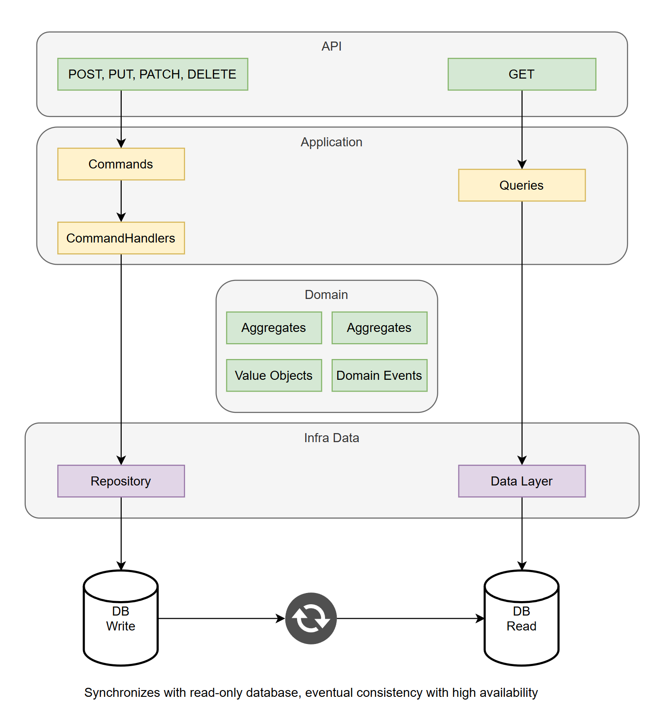

# Inventory Management API

## 1. Contexto

Este projeto é um protótipo para otimização de um sistema de gerenciamento de inventário distribuído.

### Cenário Atual
O cenário atual envolve:

- Cada loja da rede possui um banco de dados local, sincronizando periodicamente com um banco central a cada 15 minutos
- Clientes visualizam estoque online, mas inconsistências causam problemas de experiência e perdas de vendas
- O backend é monolítico e o frontend é legado

### Objetivos do Protótipo
- Reduzir a latência de atualização de estoque
- Garantir consistência de inventário em um ambiente distribuído
- Implementar observabilidade para rastreamento de operações críticas
- Criar endpoints RESTful para operações de inventário

## 2. Principais Decisões Técnicas

### Arquitetura
**CQRS + Clean Architecture + DDD (Domínio Rico)**
- Separação clara de Command (writes) e Query (reads)
- Agregados, entidades e objetos de valor modelando regras de negócio críticas
- `InventoryItem` como agregado principal, responsável por reservas, confirmações, liberações e reposições
- Eventos de domínio para ações importantes (ReservaCriada, ReservaConfirmada, ReservaLiberada, EstoqueReposto)

**Diagrama da Arquitetura**

### Banco Central Único (SQLite In-Memory para protótipo)
- Evita complexidade de sincronização entre lojas

### Lock Pessimista
- Garantia de consistência em reservas e commits simultâneos
- **Trade-off:** menor disponibilidade em cenários de alta concorrência

### Endpoints Principais
- `GET /api/v1/inventory/{storeId}/sku/{sku}` → Consulta disponibilidade de SKU
- `POST /api/v1/inventory/{storeId}/sku/{sku}/reserve` → Reserva unidades de SKU
- `POST /api/v1/inventory/{storeId}/sku/{sku}/commit` → Confirma reserva
- `POST /api/v1/inventory/{storeId}/sku/{sku}/release` → Libera reserva
- `POST /api/v1/inventory/{storeId}/sku/{sku}/replenish` → Reposição de estoque

> Todos endpoints estão documentados via Swagger com exemplos de request e response.

### Persistência e Concorrência
- Entity Framework Core com SQLite In-Memory para protótipo
- Implementação de Unit of Work para controle de transações
- Lock pessimista usado para operações críticas (usar `FOR UPDATE` em SQL))

### Observabilidade
**OpenTelemetry**
- Jaeger para visualização de traces, logs e métricas de requests e operações críticas
- Logs correlacionados com traceId e spanId
- Implementação simples para facilitar entendimento e extensão com objetivo de apontamento em ferramentas de APM

### Testes
- Testes unitários para handlers e agregados

## 3. Ferramentas e Tecnologias

### Stack Principal
- **.NET 9 (C#)**
- **ORM - Entity Framework Core**
- **SQLite (In-Memory)**
- **OpenTelemetry + Jaeger**
- **Swagger / OpenAPI**

### Ferramentas de Desenvolvimento
- **Visual Studio 2022 integrado com GitHub Copilot utilizando modelo Claude Sonnet 3.5**
  - Auxílio na geração de boilerplate, handlers, DTOs, testes e documentações
- **ChatGPT-4**
  - Entendimento de contexto de negócio, discussão de arquitetura, trade-offs, melhores práticas e ajuda na criação de prompts para o Copilot	 

## 4. Trade-offs e Decisões Avaliadas

| Decisão | Opção Avaliada | Trade-off |
|---------|---------------|-----------|
| **Concurrency** | Lock pessimista | Prioriza consistência sobre disponibilidade |
| **Persistência** | SQLite in-memory | Simplicidade para protótipo, não persistente para produção |
| **Observabilidade** | Jaeger | Simplificação de monitoramento |
| **CQRS** | Separação de operações | Separa writes/reads, permite evolução para Event Sourcing |

## 5. Itens Considerados para Produção

### Infraestrutura
- Aplicação stateless para escalabilidade Horizontal (Scale Out) via containers (Docker + Kubernetes / AKS / EKS)
- Load balancer para distribuição de tráfego (NGINX, AWS ALB)
- Banco real podendo ser (PostgreSQL, SQL Server ou NoSQL distribuído) juntamente com replica de leitura ou banco dedicado para consultas

### Performance e Confiabilidade
- Cache local por loja para reduzir latência de leitura
- Circuit Breaker e Retry Policy para tolerância a falhas

### Monitoramento
- Avaliar utilização de ferramentas APM (NewRelic, Datadog, Application Insights)
- Criação de dashboards e alertas

### Segurança
- Autenticação e autorização (OAuth2, JWT)
- Avaliar utilização de API Gateway e implementação de rate limiting (Kong, aws API Gateway))
- Gereciamento de segredos (Azure Key Vault, AWS Secrets Manager)

## 6. Evolução do Protótipo

### Vantagens Arquiteturais
- Facilidade em envolução para Event Sourcing completo com replay de eventos para reconstrução de estado, historicidade e auditoria
- Filas e tópicos (Kafka / RabbitMQ) para eventos de domínio e ou atualização de projeções no banco de leitura já que consistência eventual é aceitável para consultas, garantindo alta disponibilidade
- DDD linguagem ubíqua facilita comunicação entre times técnicos e de negócio
- Estrutura modular facilita substituição de SQLite por banco real
- Observabilidade pode ser expandida facilmente sem acoplamento com ferramentas externas, devido ao padrão OpenTelemetry

## 7. Como Executar

Para instruções detalhadas de execução via Visual Studio, consulte o arquivo `RUM.md`.
